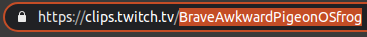

Twitch Clip Chat
==========================

Python package for scrapping chat from Twitch clips

Requirements
------------

1. Python 3.7+

Installation
------------

```shell
$ git clone https://github.com/stricklerxc/twitch-clip-chat.git
$ cd twitch-clip-chat
$ python3 -m venv .env
$ source .env/bin/activate
(.env) $ pip install .
```

Usage
-----

1. Register your application using the [Twitch Developer Console](https://dev.twitch.tv/console/apps)
2. Configure Twitch Client Credentials

    ```shell
    $ clip_chat configure
    Twitch Client ID: <client_id>
    Twitch Client Secret: <client_secret>
    ```

3. Grab Clip Chat

    ```shell
    $ clip_chat get <slug>
    ```

    Notes:

    - Chat is output in CSV format in your current working directory. Filename is \<slug\>.csv
        - CSV Columns: Timestamp, Username, Message
    - The "slug" is the last part of the clip's URL (see highlighted portion of image below)

        
